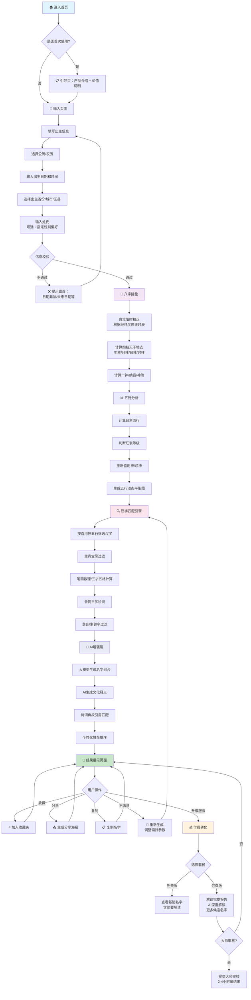
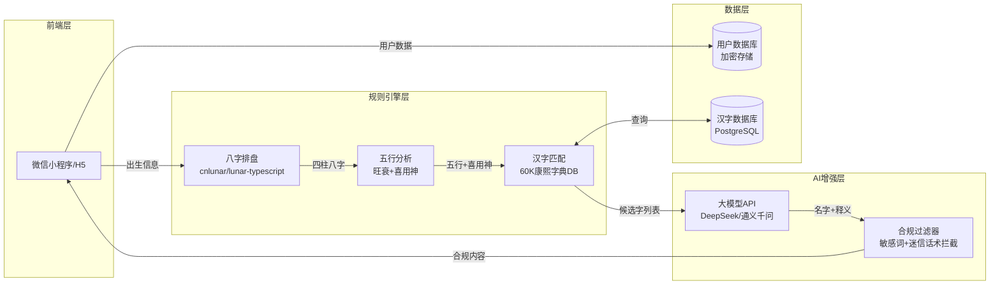
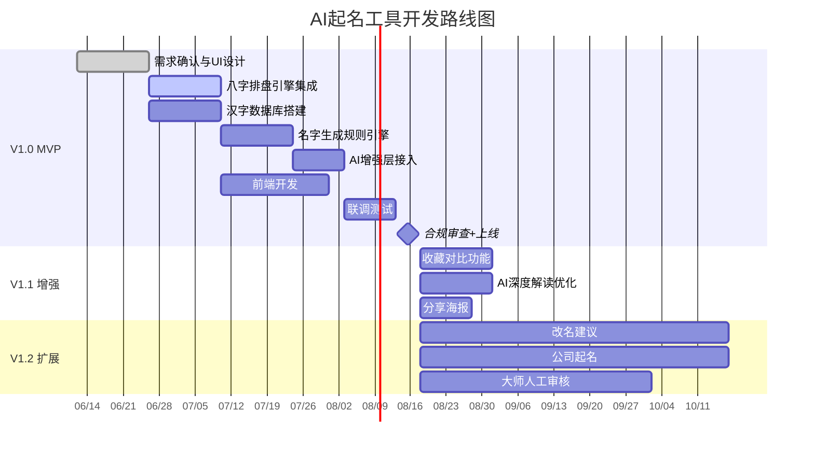

---
AIGC:
    Label: "1"
    ContentProducer: 001191110102MACQD9K64018705
    ProduceID: 965799332296643_0/project_7650447357674471680-files/docs/AI起名_PRD.md
    ReservedCode1: ""
    ContentPropagator: 001191110102MACQD9K64028705
    PropagateID: 965799332296643#1781913713258
    ReservedCode2: ""
---
# AI起名工具 — 产品需求文档（PRD）

> **版本**：v1.0 | **日期**：2026-06-12 | **作者**：产品团队  
> **状态**：MVP规划中 | **预计首个迭代周期**：3个月

---

## 一、产品概述

### 1.1 一句话定位

**一款以「八字五行精准排盘 + 汉字文化深度匹配」为核心、AI大模型增强体验的智能起名工具。**  
定位为「AI起名工具」（文化解读 + 音形义筛选），**不是「AI算命」**。

### 1.2 目标用户

| 用户群 | 占比（预估） | 核心场景 |
|--------|:--------:|---------|
| 新生儿父母（25-35岁） | 60% | 为新生儿取一个好名字，兼顾八字五行补缺、音韵美感、文化寓意 |
| 成人改名用户 | 25% | 对现有名字不满意，希望根据八字重新匹配一个更合适的名字 |
| 海外华人 | 15% | 身在海外，希望通过在线工具获得传统文化起名服务，解决时区差异问题 |

### 1.3 核心价值主张

| 痛点 | 我们的解决方案 |
|------|--------------|
| 现有AI起名排盘不准（大模型直接排盘错误率40%） | **规则引擎排盘**，cnlunar/lunar-typescript 保证100%准确 |
| 「缺啥补啥」过于机械，未区分喜用神与五行缺失 | **五行旺衰 + 喜用神推断**，精准定位真正需要补的五行 |
| 名字同质化严重（梓涵、一诺泛滥） | **60,000条康熙字典数据库** + AI文化释义，生成差异化名字 |
| 解读浅层，缺乏文化深度 | **大模型深度解读**：诗词典故、字形字义、音韵分析 |
| 海外华人无法享受专业服务 | **真太阳时校正** + 全线上服务，覆盖全球时区 |

### 1.4 产品差异化定位

```
┌──────────────────────────────────────────────────┐
│           竞品：大模型直接起名                      │
│   输入 → 大模型 → 名字（排盘40%错误率）             │
│   同质化严重，解读 = 话术拼接                       │
└──────────────────────────────────────────────────┘
                        vs
┌──────────────────────────────────────────────────┐
│        本产品：规则引擎 + AI增强（混合架构）         │
│   输入 → 规则引擎排盘（100%准确）→ 汉字匹配引擎     │
│        → AI文化深度解读 → 个性化名字推荐            │
│   精准排盘 + 深度解读 + 差异化的名字                 │
└──────────────────────────────────────────────────┘
```

---

## 二、用户画像

### 2.1 画像一：新生儿父母 —「小雅」

| 维度 | 描述 |
|------|------|
| **基本信息** | 28岁，女性，孕晚期准妈妈，一线城市，本科以上学历 |
| **行为特征** | 活跃于小红书/妈妈群，已浏览20+起名笔记，收藏「好听的名字」合集 |
| **核心诉求** | 给宝宝一个「有讲究」的名字——既符合八字五行，又音韵好听、不烂大街 |
| **付费意愿** | 愿意为品质付费（200-500元），但不信任高价「大师」 |
| **决策心理** | 「怕后悔」——68%付费用户核心动机，属于决策责任外移心理 |
| **使用场景** | 产前1-2个月开始关注，产后1个月内确定名字 |

### 2.2 画像二：成人改名 —「浩然」

| 维度 | 描述 |
|------|------|
| **基本信息** | 32岁，男性，二三线城市，职场中层，对现有名字不满意 |
| **行为特征** | 在抖音/百度搜索「改名流程」「改名注意事项」 |
| **核心诉求** | 改名后运势改善，名字更符合个人气质，同时了解改名法律流程 |
| **付费意愿** | 中等（100-500元），需要看到专业分析后才愿意付费 |
| **决策心理** | 「名字确实影响第一印象」——对八字五行有一定了解但非专业 |
| **使用场景** | 换工作/人生转折点时触发改名需求 |

### 2.3 画像三：海外华人 —「David」

| 维度 | 描述 |
|------|------|
| **基本信息** | 35岁，男性，硅谷工程师，孩子在美国出生，想取中文名 |
| **行为特征** | Google搜索「Chinese name based on birthday」，找过唐人街师傅但体验差 |
| **核心诉求** | 基于孩子出生时间（需真太阳时校正）取正宗中文名，兼顾中英文发音 |
| **付费意愿** | 高（$50-$200），对价格不敏感但对专业度要求高 |
| **决策心理** | 「不能让孩子丢了文化根」——文化认同驱动 |
| **使用场景** | 孩子出生后1-3个月，远程在线完成全流程 |

---

## 三、功能需求

### 3.1 功能分层总览

| 优先级 | 定义 | 计划版本 |
|:------:|------|:--------:|
| **P0** | MVP必须上线，缺一不可 | V1.0（3个月） |
| **P1** | 核心体验增强，提升留存与转化 | V1.1（+2个月） |
| **P2** | 拓展场景与高端变现 | V1.2+（持续迭代） |

### 3.2 P0 — MVP核心功能

| 序号 | 功能名 | 优先级 | 用户故事 | 验收标准 |
|:----:|--------|:------:|---------|---------|
| P0-1 | **出生信息输入** | P0 | 作为新生儿父母，我想输入宝宝的出生日期、时间、地点和姓氏，以便系统为我生成个性化的名字推荐 | ① 支持公历/农历切换输入；② 支持精确到小时的出生时间输入；③ 支持省-市-区三级地区选择（用于真太阳时校正）；④ 输入校验：拒绝未来日期、非法日期组合 |
| P0-2 | **八字排盘** | P0 | 作为用户，我想看到准确的八字四柱排盘结果，以便我相信这个工具的专业性 | ① 排盘完成时间 < 1秒；② 四柱（年/月/日/时）天干地支100%准确（对比cnlunar标准输出）；③ 支持真太阳时校正（根据出生地经纬度）；④ 支持节气交界的正确处理 |
| P0-3 | **五行分析** | P0 | 作为用户，我想了解宝宝的五行旺衰情况，以便我知道名字中应该补哪个五行 | ① 输出日主五行及旺衰等级（过旺/偏旺/中和/偏弱/过弱）；② 输出喜用神与忌神判断；③ 输出五行缺失与过旺的直观可视化展示（五行动态平衡图）；④ 标注「建议补益五行」 |
| P0-4 | **汉字匹配** | P0 | 作为用户，我希望能根据五行分析结果，从海量汉字中筛选出适合的用字 | ① 基于60,000条康熙字典数据库筛选；② 按喜用神五行过滤汉字；③ 支持生肖宜忌过滤（如鼠年不宜用"午"字根）；④ 支持笔画数理（三才五格）计算；⑤ 过滤生僻字、明显负面谐音字 |
| P0-5 | **名字生成** | P0 | 作为用户，我想获得多组候选名字（含姓氏），每个名字都有基本解析 | ① 每次生成 ≥ 10 组候选名字；② 每组含：全名、五行属性标注、简要字义、拼音；③ 支持单字名/双字名切换；④ 生成时间 < 5秒 |
| P0-6 | **结果展示** | P0 | 作为用户，我想看到完整的起名报告，包括八字排盘、五行分析、名字列表和解读 | ① 报告包含：八字排盘信息、五行分析图、候选名字列表、每个名字的解读；② 支持一键复制名字；③ 页面底部显著标注免责声明：「内容仅为传统文化民俗参考，不构成人生决策依据」 |

### 3.3 P1 — V1.1 增强功能

| 序号 | 功能名 | 优先级 | 用户故事 | 验收标准 |
|:----:|--------|:------:|---------|---------|
| P1-1 | **名字收藏对比** | P1 | 作为用户，我想收藏心仪的名字并放在一起对比，以便我和家人共同决策 | ① 支持收藏/取消收藏名字；② 对比视图展示：五行、笔画、音韵、寓意四维对比；③ 收藏数据与用户账号绑定，跨设备同步 |
| P1-2 | **AI寓意深度解读** | P1 | 作为用户，我想看到名字的深度文化解读（诗词典故、字义溯源、文化内涵），以便我理解名字的真正含义 | ① 每个名字附带 AI 生成的深度解读（100-200字）；② 包含：诗词典故引用、字形字义分析、五行哲学解读；③ 解读内容通过合规过滤器（无宿命论/迷信话术） |
| P1-3 | **分享海报** | P1 | 作为用户，我想把起名结果生成精美海报分享到朋友圈/小红书，以便记录和分享这份喜悦 | ① 一键生成分享海报；② 海报含：名字、核心寓意、五行元素设计、产品品牌水印；③ 支持3种以上视觉风格模板 |
| P1-4 | **历史记录** | P1 | 作为用户，我想查看之前的起名记录，以便回顾和继续未完成的起名决策 | ① 按时间倒序展示历史起名记录；② 支持删除历史记录；③ 数据加密存储（等保三级） |

### 3.4 P2 — V1.2+ 扩展功能

| 序号 | 功能名 | 优先级 | 用户故事 | 备注 |
|:----:|--------|:------:|---------|------|
| P2-1 | **改名建议** | P2 | 作为对现有名字不满意的用户，我想输入现用名+生辰，获得改名方案和注意事项 | 含改名法律流程指引 |
| P2-2 | **公司/品牌起名** | P2 | 作为创业者，我想为我的公司取一个符合行业五行、朗朗上口的名字 | 第二增长曲线，客单价更高 |
| P2-3 | **大师人工审核** | P2 | 作为付费用户，我想让专业命理师审核AI生成的名字，确保万无一失 | 客单价498-1,980元 |
| P2-4 | **多语言支持** | P2 | 作为海外华人，我想看到英文版的起名报告，以便与非中文家人分享 | 面向海外华人市场 |
| P2-5 | **伴侣协同选名** | P2 | 作为夫妻，我们想各自浏览名字后匹配共同喜欢的，以便高效达成共识 | 参考NameHatch的Tinder式匹配模式 |

---

## 四、用户故事（User Stories）

### 4.1 P0 核心用户故事

**US-001：输入出生信息并获取八字排盘**
> As a 新生儿母亲，I want to 输入宝宝的出生日期、时间和出生地点，So that 系统能准确排出宝宝的八字四柱，为后续起名提供专业依据。

**US-002：查看五行分析并理解用字方向**
> As a 对传统文化感兴趣的父亲，I want to 看到直观的五行旺衰分析和喜用神建议，So that 我能理解宝宝名字中应该侧重哪个五行的字。

**US-003：获得候选名字列表**
> As a 追求品质的妈妈，I want to 获得多组基于八字五行匹配、音韵优美的候选名字，So that 我能从中选出最满意的名字，而不用在海量信息中盲目搜索。

**US-004：查看完整起名报告**
> As a 第一次当父母的用户，I want to 获得一份包含八字分析、五行解读、名字推荐的完整报告，So that 我对起名决策更有信心，也便于和家人讨论。

### 4.2 P1 增强用户故事

**US-005：收藏并对比候选名字**
> As a 纠结的新手妈妈，I want to 收藏几个心仪的名字并并排对比它们的五行、寓意、音韵，So that 我能做出更理性的最终选择。

**US-006：分享起名海报到社交平台**
> As a 小红书活跃用户，I want to 把AI起名结果生成精美海报分享出去，So that 我能记录宝宝的起名过程，也能向朋友展示我做的功课。

### 4.3 P2 扩展用户故事

**US-007：获得大师人工审核**
> As a 对AI结果仍有顾虑的付费用户，I want to 让专业命理师审核AI生成的名字，So that 我能获得双重保障，对最终选择完全放心。

---

## 五、核心业务流程

### 5.1 完整用户旅程



### 5.2 数据流架构



---

## 六、非功能需求

### 6.1 性能要求

| 指标 | 目标值 | 测量方法 |
|------|:------:|---------|
| 八字排盘响应时间 | < 1 秒 | 从提交出生信息到排盘结果返回 |
| 名字生成响应时间 | < 5 秒 | 从排盘完成到候选名字列表展示 |
| AI解读生成时间 | < 3 秒 | 单个名字的深度解读 |
| 页面首屏加载 | < 2 秒（4G网络） | Lighthouse Performance Score ≥ 90 |
| 并发支持 | ≥ 500 QPS（MVP阶段） | 压力测试 |

### 6.2 准确率要求

| 指标 | 目标值 | 说明 |
|------|:------:|------|
| 八字排盘准确率 | **100%** | 与cnlunar标准输出一致，含真太阳时校正 |
| 五行旺衰判断准确率 | ≥ 95% | 与专业命理师判断一致率 |
| 汉字五行属性准确率 | ≥ 99% | 基于康熙字典标准 |
| AI解读内容合规率 | **100%** | 无宿命论/鬼神论/迷信话术 |

### 6.3 安全与合规

| 要求 | 标准 | 说明 |
|------|------|------|
| 数据安全等级 | **等保三级** | 用户生辰数据加密存储，传输层TLS 1.3 |
| 算法备案 | 完成生成式AI服务备案 | 参照已备案的17款紫微AI产品流程 |
| 内容安全 | 强制免责声明标注 | 首页及报告页显著标注「内容仅为传统文化民俗参考，不构成人生决策依据」 |
| 大模型输出合规 | 内容过滤中间件 | 实时拦截：宿命论、改运消灾、鬼神论、诱导大额消费等话术 |
| 隐私合规 | 《个人信息保护法》 | 用户可随时删除个人数据，明示数据用途，获取用户同意 |
| 用户年龄限制 | 仅供18岁以上用户使用 | 或未成年人需监护人陪同使用 |

### 6.4 兼容性要求

| 平台 | 最低支持版本 | 备注 |
|------|:----------:|------|
| iOS | iOS 15+ | Safari / 微信内置浏览器 |
| Android | Android 10+ | Chrome / 微信内置浏览器 |
| 微信小程序 | 微信 8.0+ | 基础库 2.20+ |
| PC Web | Chrome 90+ / Edge 90+ / Safari 15+ | 响应式设计 |

---

## 七、推荐技术栈

| 层级 | 技术选型 | 选型理由 |
|------|---------|---------|
| **排盘引擎** | `lunar-typescript`（npm，MIT协议） | 轻量（<50KB），含八字排盘/节气/黄历，TypeScript类型完善，前端/小程序可直接用 |
| **真太阳时校正** | `shunshi-bazi-core`（npm，MIT协议） | 内置真太阳时校正，精准处理时区差异 |
| **汉字数据库** | PostgreSQL + 开源康熙字典SQL库（60,000条） | 含简繁体、拼音、笔画、五行属性、吉凶解释 |
| **名字生成** | 规则引擎（Python/Node.js） | 五行筛选 + 笔画计算 + 音韵检测 + 谐音过滤 |
| **AI增强** | DeepSeek / 通义千问 API | 国产大模型，成本极低（约¥0.02/千次），中文命理术语理解优于西方模型 |
| **前端** | 微信小程序 + React H5 | 小程序获客 + H5覆盖海外用户 |
| **后端** | Node.js (NestJS) 或 Python (FastAPI) | 快速开发，生态完善 |
| **合规中间件** | 自研内容过滤中间件 | 敏感词过滤 + 迷信话术拦截 + 免责声明自动注入 |
| **部署** | 阿里云/腾讯云 + Vercel（H5） | 国内合规 + 海外加速 |

---

## 八、合规与风险应对

### 8.1 政策风险矩阵

| 风险 | 等级 | 应对措施 |
|------|:----:|---------|
| 清朗行动将「AI起名」列入打击范围 | 🔴 高 | ① 定位为「传统文化科普+姓名学工具」，非「AI算命」；② 所有输出强制标注「仅供文化参考」；③ 完成算法备案和内容安全审核 |
| 用户因名字引发纠纷 | 🟡 中 | ① 免责声明覆盖所有输出页面；② 用户协议明确「不构成人生决策依据」；③ 购买专业责任保险 |
| 大模型输出迷信内容 | 🟡 中 | ① 合规过滤器实时拦截宿命论/鬼神论话术；② 定期人工审核大模型输出样本；③ 建立内容黑名单词库 |
| 出生人口下降导致市场收窄 | 🟢 低 | ① 拓展改名市场（12.8亿元）；② 拓展公司品牌命名（客单价12,600元）；③ 拓展海外华人市场 |

### 8.2 合规清单

- [ ] 完成生成式AI服务算法备案
- [ ] 通过内容安全审核（网信办）
- [ ] 完成等保三级认证
- [ ] 用户隐私协议 + 数据删除机制
- [ ] 产品全页面免责声明标注
- [ ] 大模型输出合规过滤中间件上线
- [ ] 建立用户投诉与内容举报通道

---

## 九、商业模式

### 9.1 定价策略

| 层级 | 价格 | 核心内容 | 目标占比 |
|------|:----:|---------|:------:|
| **免费版** | ¥0 | 八字排盘 + 五行分析 + 3个候选名字 + 简要解读 | 获客引流 |
| **标准版** | ¥98 | 完整报告 + 20个候选名字 + AI深度解读 + 收藏对比 + 分享海报 | 40% |
| **专业版** | ¥498 | 标准版全部 + 人工大师审核 + 3次修改 + 专属命理报告 | 35% |
| **大师定制** | ¥1,980 | 专业命理师一对一服务 + 不限次修改 + 改名法律流程指导 | 25% |

### 9.2 收入预估（月稳定期）

| 层级 | 月销量 | 收入 |
|------|:-----:|:-----:|
| 标准版（¥98） | 1,000单 | ¥98,000 |
| 专业版（¥498） | 200单 | ¥99,600 |
| 大师定制（¥1,980） | 30单 | ¥59,400 |
| **月合计** | | **¥257,000** |

---

## 十、里程碑与迭代计划



---

## 十一、附录

### A. 竞品关键差距（本产品针对性解决）

| 竞品短板 | 本产品方案 |
|---------|-----------|
| 排盘不准（大模型直接排盘错误率40%） | cnlunar规则引擎 + 真太阳时校正，100%准确 |
| 缺啥补啥过于机械 | 喜用神推断 + 五行旺衰综合分析 |
| 名字同质化 | 60,000条康熙字典库 + AI差异化生成 |
| 解读浅层 | 大模型深度文化解读：诗词典故 + 字义溯源 |
| 海外服务缺失 | 真太阳时全时区覆盖 + 多语言报告 |

### B. 关键数据来源

- 市场数据：易观分析、博研咨询（2025年）
- 技术评测：BaziQA Live Benchmark（200道八字竞赛题，1000轮实验）
- 合规政策：2025年"清朗·整治AI技术滥用"专项行动
- 开源资源：lunar-typescript (MIT)、cnlunar (MIT)、康熙字典开源数据库

### C. 术语说明

| 术语 | 说明 |
|------|------|
| 八字四柱 | 年柱、月柱、日柱、时柱，由出生时间的干支组成 |
| 日主 | 日柱的天干，代表命主本人 |
| 喜用神 | 对日主有利的五行 |
| 真太阳时 | 根据出生地经度校正后的实际太阳时间，非标准北京时间 |
| 三才五格 | 天格、人格、地格（三才）；总格、外格（合称五格），姓名学笔画数理体系 |

---

> **免责声明**：本文档为产品需求文档，所描述的功能和计划可能随市场变化和合规要求调整。最终产品将严格遵循《生成式人工智能服务管理暂行办法》及相关法律法规，所有输出内容仅供传统文化民俗参考。

---

> 本内容由 Coze AI 生成，请遵循相关法律法规及《人工智能生成合成内容标识办法》使用与传播。
