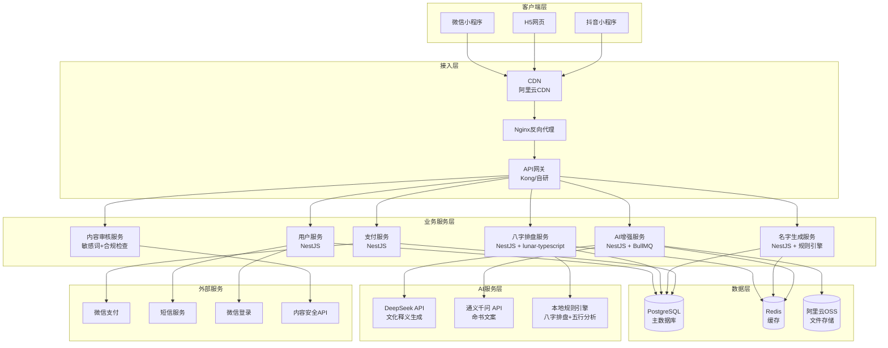
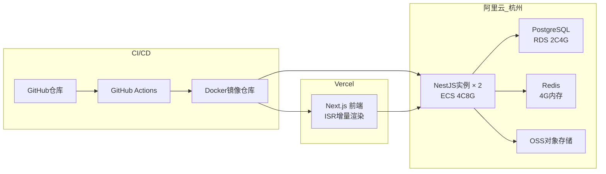
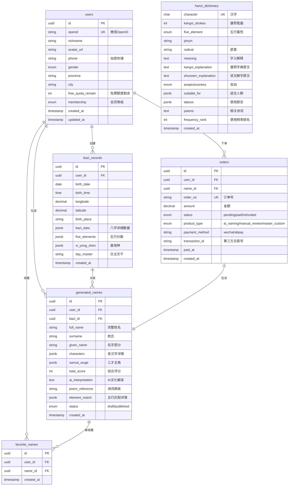
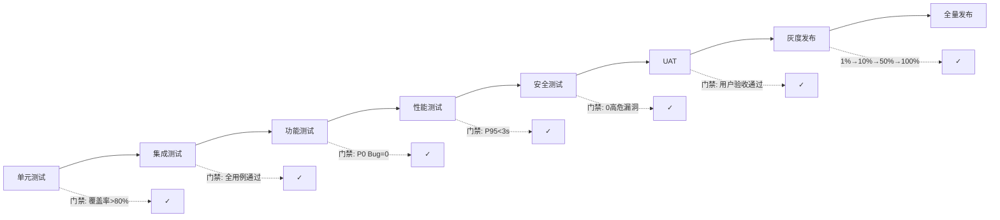

---
AIGC:
    Label: "1"
    ContentProducer: 001191110102MACQD9K64018705
    ProduceID: 965799332296643_0/project_7650447357674471680-files/docs/AI起名_技术方案.md
    ReservedCode1: ""
    ContentPropagator: 001191110102MACQD9K64028705
    PropagateID: 965799332296643#1781913746517
    ReservedCode2: ""
---
# AI起名工具 — 技术架构方案 + 数据模型设计 + 测试策略

> 版本：v1.0 | 日期：2026-06-12 | 基于深度调研报告与开源资源盘点

---

## Part 1: 技术架构方案

### 1.1 技术选型总览

| 层级 | 技术 | 版本 | 选型理由 |
|------|------|------|---------|
| **八字排盘** | lunar-typescript | latest | MIT协议，<50KB轻量，TypeScript类型完善，支持真太阳时，可直接在前端/Node.js运行 |
| **五行分析引擎** | 自研（基于bazi-calculator参考） | v1.0 | 现有开源库五行旺衰判断偏简化，需自定义日主强弱+喜用神推断算法 |
| **汉字数据库** | PostgreSQL + 康熙字典开源SQL | 60,000+条 | 含简繁体、五行属性、笔画、拼音、释义、吉凶，覆盖全量汉字 |
| **名字生成引擎** | 自研规则引擎（TypeScript） | v1.0 | 五行匹配 + 三才五格 + 生肖过滤 + 音韵检测，确定性规则确保可复现 |
| **AI增强层** | DeepSeek API / 通义千问 API | latest | 国产模型在中文命理术语理解上优于西方模型，成本极低（约¥0.02/千次调用） |
| **前端框架** | Next.js 14 | 14.x | SSR/SSG支持，Vercel一键部署，生态成熟 |
| **小程序** | Taro 3 | 3.x | 一套代码多端编译（微信/支付宝/抖音小程序+H5） |
| **后端框架** | NestJS | 10.x | TypeScript全栈统一，依赖注入+模块化，适合复杂业务逻辑 |
| **数据库** | PostgreSQL 15 | 15.x | 支持JSONB存储八字数据，全文检索汉字，扩展性强 |
| **缓存** | Redis | 7.x | 排盘结果缓存、限流、汉字热数据缓存 |
| **消息队列** | BullMQ (Redis-based) | latest | AI调用异步化、名字批量生成任务调度 |
| **对象存储** | 阿里云OSS / 腾讯云COS | — | 命书PDF/图片存储 |
| **CI/CD** | GitHub Actions | — | 自动测试+构建+部署 |
| **监控** | Sentry + 自研日志 | — | 错误追踪 + API调用链监控 |

### 1.2 系统架构图



### 1.3 核心模块设计

#### 1.3.1 八字排盘模块

**选型**：`lunar-typescript`（MIT协议），核心API调用链路：

```
用户输入(公历日期+时辰+出生地点)
        │
        ▼
┌──────────────────────────┐
│  经纬度→真太阳时校正      │  ← 自研校正层
│  输入：经度、日期          │
│  计算：平太阳时+均时差     │
│  输出：校正后的真太阳时    │
└──────────┬───────────────┘
           │
           ▼
┌──────────────────────────┐
│  lunar-typescript 排盘    │
│  Lunar.fromDate(date)     │
│  → getEightChar()         │
│  输出：年柱/月柱/日柱/时柱 │
└──────────┬───────────────┘
           │
           ▼
      八字对象 { year, month, day, hour }
      天干地支 + 藏干 + 十神 + 纳音
```

**真太阳时校正方案**（自研层核心逻辑）：

| 步骤 | 计算内容 | 说明 |
|------|---------|------|
| 1. 获取出生地经度 | 通过地点名→经纬度API（高德/百度地图） | 支持城市级精度 |
| 2. 计算时区差 | `timezoneOffset = (经度 - 120) × 4` 分钟 | 北京时间基准120°E |
| 3. 计算均时差 | 基于日期计算太阳时与平太阳时偏差 | ±15分钟范围 |
| 4. 真太阳时 | `真太阳时 = 北京时间 + 时区差 + 均时差` | 最终用于确定时辰 |
| 5. 时辰映射 | 按真太阳时落入区间映射12时辰 | 子时23:00-01:00 等 |

**节气交界月柱修正**：lunar-typescript已内置节气计算，月柱以节气为界（立春为寅月始等）。但需在节气日当天做边界测试验证。

#### 1.3.2 五行分析模块

**日主旺衰判断算法**：

```
输入：八字四柱 { 年柱, 月柱, 日柱, 时柱 }
       │
       ▼
Step 1: 日主五行确定
  - 日柱天干 → 五行属性（甲乙=木、丙丁=火...）
       │
       ▼
Step 2: 月令旺衰权重（最关键）
  - 月支对应五行 → 得令/失令判断
  - 权重矩阵：
    同五行月令 → +40分
    生我月令 → +30分
    我生月令 → +20分
    克我月令 → +10分
    我克月令 → +5分
       │
       ▼
Step 3: 全局五行力量计算
  - 统计四柱天干+地支藏干中各五行出现次数
  - 地支权重 > 天干权重（地支占60%，天干占40%）
  - 通根判断：地支藏干含日主同五行 → 额外加分
       │
       ▼
Step 4: 日主强弱判定
  - 总分 ≥ 60 → 身强
  - 40 ≤ 总分 < 60 → 中和
  - 总分 < 40 → 身弱
       │
       ▼
Step 5: 喜用神推断
  - 身强 → 喜克泄耗（克我/我生/我克五行）
  - 身弱 → 喜生扶（生我/同我五行）
  - 中和 → 根据具体八字平衡
       │
       ▼
输出：{ 日主强弱, 喜神五行, 用神五行, 忌神五行, 各五行分数 }
```

#### 1.3.3 名字生成引擎

**五层过滤管道设计**：

```
候选汉字全集（60,000+）
       │
       ▼
[第一层] 五行匹配过滤
  保留：喜用神五行属性汉字
  排除：忌神五行属性汉字
  输出范围：~15,000字
       │
       ▼
[第二层] 生肖宜忌过滤
  保留：当前生肖喜用偏旁部首
  排除：生肖禁忌偏旁部首
  例：鼠年忌"火""日"旁（鼠怕光）
  输出范围：~8,000字
       │
       ▼
[第三层] 笔画数理筛选
  三才五格计算（天格/人格/地格/外格/总格）
  保留：数理81吉数（1-81数理吉凶表）
  排除：大凶数理
  输出范围：~3,000字组合
       │
       ▼
[第四层] 音韵检测
  平仄搭配检查（平平仄仄/仄仄平平优先）
  声母避免同组（如zh/ch/sh不连续）
  韵母避免拗口组合
  排除谐音不雅词汇（建立谐音黑名单）
  输出范围：~500个候选名
       │
       ▼
[第五层] 综合评分排序
  文化内涵加分（诗词典故匹配）
  字形美感加分（结构均衡）
  音韵美感加分
  输出：Top 20推荐名字
```

**三才五格计算规则**：

| 格数 | 计算方式 | 说明 |
|------|---------|------|
| 天格 | 姓氏笔画+1（单姓）或姓氏两字笔画和（复姓） | 祖运 |
| 人格 | 姓氏末字+名字首字笔画 | 主运，最重要 |
| 地格 | 名字两字笔画和（双名）或名字+1（单名） | 前运 |
| 外格 | 总格-人格+1 | 副运 |
| 总格 | 姓名字笔画总和 | 后运 |

#### 1.3.4 AI增强模块

**大模型调用策略**：

| 场景 | 模型选择 | 调用时机 | 成本控制 |
|------|---------|---------|---------|
| 名字文化释义 | DeepSeek-V3 | 规则引擎筛选后，对Top 20名字逐一生成 | 批量调用，控制Token |
| 命书文案生成 | 通义千问 | 用户下单后异步生成 | 队列化处理 |
| 诗词典故匹配 | 规则优先（gushi_namer）+ AI兜底 | 规则库命中则跳过AI | 减少无效调用 |
| 个性化推荐排序 | DeepSeek | 用户偏好不明确时 | 仅付费用户 |

**Prompt工程设计（名字文化释义）**：

```
System: 你是一位精通中国传统姓名学的文化学者。你的任务是为给定的汉字名字提供文化解读。

约束：
1. 解释名字中每个汉字的含义和五行属性
2. 引用与名字相关的诗词典故（1-2条）
3. 分析名字的音韵特点和字形美感
4. 说明名字的整体寓意和祝愿
5. 禁止使用"改运""消灾""避祸""大吉大利""一生富贵"等迷信话术
6. 禁止将名字与命运、祸福做因果关联
7. 语气定位为"文化民俗参考"，结尾标注"以上解读为传统文化视角的赏析，仅供参考"
8. 字数控制在150-250字

User: 请解读名字"{名字}"，该名字推荐给{性别}{生肖}年出生的宝宝。
```

**AI输出合规过滤层**：

```
AI原始输出
    │
    ▼
┌────────────────────┐
│ 敏感词过滤          │ ← 正则+词典匹配
│ 迷信话术检测        │ ← NLP分类模型
│ 政治敏感检测        │ ← 第三方API
└──────┬─────────────┘
       │ (任一命中 → 重新生成/降级为规则模板)
       ▼
  合规输出 + 免责声明追加
```

#### 1.3.5 汉字数据库

**康熙字典数据导入方案**：

```
数据源：开源康熙字典SQL库（60,000+条）
       │
       ▼
┌─────────────────────────┐
│ ETL预处理脚本            │
│ 1. 数据清洗：去重、补缺 │
│ 2. 五行属性补全：        │
│    - 字形法推断（偏旁部首）│
│    - 字义法交叉验证       │
│ 3. 笔画标准化（康熙笔画）│
│ 4. 拼音补全              │
│ 5. 吉凶标记标准化        │
└──────┬──────────────────┘
       │
       ▼
PostgreSQL批量导入 (COPY命令)
       │
       ▼
索引构建 → 全文检索配置 → 热数据预加载Redis
```

### 1.4 API设计（RESTful）

#### 接口列表

| 方法 | 路径 | 说明 | 认证 |
|------|------|------|------|
| POST | `/api/v1/bazi/calculate` | 八字排盘 | 可选（免费试用限次） |
| GET | `/api/v1/bazi/{id}` | 排盘记录详情 | 必需 |
| POST | `/api/v1/names/generate` | 名字生成（核心） | 必需（付费） |
| GET | `/api/v1/names/{id}` | 名字详情+文化解读 | 必需 |
| POST | `/api/v1/names/{id}/favorite` | 收藏名字 | 必需 |
| DELETE | `/api/v1/names/{id}/favorite` | 取消收藏 | 必需 |
| GET | `/api/v1/favorites` | 收藏列表 | 必需 |
| GET | `/api/v1/hanzi/search` | 汉字查询 | 可选 |
| GET | `/api/v1/hanzi/{char}` | 单字详情 | 可选 |
| POST | `/api/v1/orders` | 创建订单 | 必需 |
| GET | `/api/v1/orders/{id}` | 订单详情 | 必需 |
| POST | `/api/v1/auth/wechat/login` | 微信登录 | — |
| GET | `/api/v1/users/profile` | 用户信息 | 必需 |

#### 核心接口详细设计

**POST /api/v1/bazi/calculate**

```json
// Request
{
  "birth_date": "2024-06-15",
  "birth_time": "14:30",
  "birth_place": {
    "province": "广东省",
    "city": "深圳市",
    "longitude": 114.0579,
    "latitude": 22.5431
  },
  "gender": "male"
}

// Response
{
  "code": 0,
  "data": {
    "id": "bz_20240615_001",
    "solar_calendar": "2024年6月15日14时30分",
    "lunar_calendar": "甲辰年五月初十日未时",
    "true_solar_time": "2024-06-15T14:18:00+08:00",
    "timezone_correction": -12,
    "bazi": {
      "year": { "stem": "甲", "branch": "辰", "na_yin": "覆灯火" },
      "month": { "stem": "庚", "branch": "午", "na_yin": "路旁土" },
      "day": { "stem": "丙", "branch": "午", "na_yin": "天河水" },
      "hour": { "stem": "乙", "branch": "未", "na_yin": "沙中金" }
    },
    "day_master": { "stem": "丙", "element": "火" },
    "five_elements": {
      "金": 1, "木": 2, "水": 1, "火": 3, "土": 1
    },
    "day_master_strength": "身强",
    "xi_yong_shen": {
      "xi_shen": ["土", "金"],
      "yong_shen": ["水"],
      "ji_shen": ["木", "火"]
    },
    "ten_gods": {
      "year": "偏印",
      "month": "偏财",
      "day": "日主",
      "hour": "正印"
    }
  }
}
```

**POST /api/v1/names/generate**

```json
// Request
{
  "bazi_id": "bz_20240615_001",
  "surname": "李",
  "gender": "male",
  "name_length": 2,
  "style_preference": "诗经楚辞",
  "max_count": 20
}

// Response
{
  "code": 0,
  "data": {
    "names": [
      {
        "id": "nm_001",
        "full_name": "李景行",
        "score": 95,
        "breakdown": {
          "five_elements_match": 30,
          "strokes_auspicious": 25,
          "phonetic_beauty": 20,
          "cultural_depth": 20
        },
        "analysis": {
          "character_1": { "char": "景", "element": "木", "strokes": 12, "meaning": "日光，风景" },
          "character_2": { "char": "行", "element": "水", "strokes": 6, "meaning": "行走，品行" },
          "sancai_wuge": { "tian": 8, "ren": 23, "di": 18, "wai": 3, "zong": 25 },
          "poem_reference": "高山仰止，景行行止 ——《诗经·小雅》"
        },
        "ai_interpretation": "景行一名，取自《诗经》...",
        "generated_at": "2024-06-15T15:00:00+08:00"
      }
      // ... 更多名字
    ],
    "total_generated": 20,
    "xi_shen_elements": ["土", "金"]
  }
}
```

### 1.5 部署方案



**环境规划**：

| 环境 | 用途 | 配置 |
|------|------|------|
| 开发环境 | 本地开发 | Docker Compose一键启动 |
| 测试环境 | 自动化测试+UAT | 阿里云低配实例（2C2G） |
| 预发布环境 | 灰度验证 | 与生产同配置，1实例 |
| 生产环境 | 正式服务 | 2实例 + 自动扩缩容 |

**CI/CD流程**：

```
Git Push → GitHub Actions
  ├─ Step 1: Lint + Type Check
  ├─ Step 2: 单元测试 + 集成测试
  ├─ Step 3: 构建Docker镜像
  ├─ Step 4: 推送到阿里云容器镜像服务
  ├─ Step 5: 部署到测试环境
  ├─ Step 6: E2E测试（Cypress）
  └─ Step 7: 人工审批 → 部署生产环境（滚动更新）
```

### 1.6 第三方服务依赖

| 服务 | 用途 | 备选方案 | 成本估算 |
|------|------|---------|---------|
| DeepSeek API | 名字文化释义、命书生成 | 通义千问/GLM-4 | ¥0.02/千次 → 月均¥200 |
| 微信登录 | 用户免注册登录 | 手机号登录 | 免费（认证¥300/年） |
| 微信支付 | 付费订单 | 支付宝 | 费率0.6% |
| 阿里云短信 | 验证码/订单通知 | 腾讯云短信 | ¥0.045/条 |
| 高德地图API | 经纬度查询（真太阳时） | 腾讯地图 | 免费额度充足 |
| 阿里云内容安全 | 敏感词检测 | 网易易盾 | ¥0.0015/次 |
| Sentry | 错误监控 | 自建 | 免费版5K events/月 |

### 1.7 性能指标

| 指标 | 目标值 | 测量方式 |
|------|--------|---------|
| 八字排盘响应时间 | < 1秒 | P95，不含网络延迟 |
| 名字生成响应时间 | < 3秒 | P95，含AI调用（异步时<1秒） |
| AI文化释义 | < 2秒/名字 | 并发调用大模型 |
| 并发支持 | 100 QPS | 压测工具wrk/k6验证 |
| 可用性 | 99.5% | 月度统计 |
| 数据库查询 | < 50ms | P95，含索引命中 |
| 汉字检索 | < 30ms | Redis缓存命中时 |

---

## Part 2: 数据模型设计

### 2.1 ER图



### 2.2 核心表设计

#### users（用户表）

| 字段名 | 类型 | 说明 | 约束 |
|--------|------|------|------|
| id | UUID | 主键 | PK, DEFAULT gen_random_uuid() |
| openid | VARCHAR(128) | 微信OpenID | UK, NOT NULL |
| unionid | VARCHAR(128) | 微信UnionID | 可空，用于跨应用识别 |
| nickname | VARCHAR(64) | 用户昵称 | 可空 |
| avatar_url | VARCHAR(512) | 头像URL | 可空 |
| phone | VARCHAR(256) | 手机号（AES-256加密） | 可空 |
| gender | VARCHAR(8) | 性别（male/female/unknown） | DEFAULT 'unknown' |
| province | VARCHAR(32) | 省份 | 可空 |
| city | VARCHAR(32) | 城市 | 可空 |
| free_quota_remain | INTEGER | 免费排盘剩余次数 | DEFAULT 3 |
| membership | VARCHAR(16) | 会员等级（free/basic/premium） | DEFAULT 'free' |
| membership_expire_at | TIMESTAMP | 会员到期时间 | 可空 |
| created_at | TIMESTAMP | 创建时间 | DEFAULT NOW() |
| updated_at | TIMESTAMP | 更新时间 | DEFAULT NOW() |

#### bazi_records（排盘记录表）

| 字段名 | 类型 | 说明 | 约束 |
|--------|------|------|------|
| id | UUID | 主键 | PK |
| user_id | UUID | 用户ID | FK → users.id, NOT NULL |
| birth_date | DATE | 公历出生日期 | NOT NULL |
| birth_time | TIME | 出生时间 | NOT NULL |
| longitude | DECIMAL(10,7) | 出生地经度 | NOT NULL |
| latitude | DECIMAL(10,7) | 出生地纬度 | NOT NULL |
| birth_place | VARCHAR(256) | 出生地描述 | 可空 |
| timezone_offset | INTEGER | 真太阳时校正偏移（分钟） | NOT NULL |
| true_solar_time | TIMESTAMP | 校正后真太阳时 | NOT NULL |
| gender | VARCHAR(8) | 性别 | NOT NULL |
| bazi_data | JSONB | 八字数据（四柱干支+纳音+藏干+十神） | NOT NULL |
| five_elements | JSONB | 五行分数 `{"金":1,"木":2,...}` | NOT NULL |
| day_master | VARCHAR(4) | 日主天干 | NOT NULL |
| day_master_strength | VARCHAR(8) | 身强/身弱/中和 | NOT NULL |
| xi_yong_shen | JSONB | 喜用神 `{"xi":["土"],"yong":["金"],"ji":["木"]}` | NOT NULL |
| da_yun | JSONB | 大运排盘 | 可空 |
| created_at | TIMESTAMP | 创建时间 | DEFAULT NOW() |

#### generated_names（生成名字记录表）

| 字段名 | 类型 | 说明 | 约束 |
|--------|------|------|------|
| id | UUID | 主键 | PK |
| user_id | UUID | 用户ID | FK → users.id |
| bazi_id | UUID | 关联排盘记录 | FK → bazi_records.id |
| surname | VARCHAR(8) | 姓氏 | NOT NULL |
| given_name | VARCHAR(16) | 名字（不含姓） | NOT NULL |
| full_name | VARCHAR(24) | 完整姓名 | NOT NULL |
| gender | VARCHAR(8) | 目标性别 | NOT NULL |
| characters | JSONB | 各汉字详情数组 | NOT NULL |
| sancai_wuge | JSONB | 三才五格 `{"tian":8,"ren":23,...}` | NOT NULL |
| wuge_analysis | JSONB | 五格吉凶解读 | 可空 |
| five_element_score | INTEGER | 五行匹配得分 | NOT NULL |
| phonetic_score | INTEGER | 音韵得分 | NOT NULL |
| cultural_score | INTEGER | 文化内涵得分 | NOT NULL |
| total_score | INTEGER | 综合评分（0-100） | NOT NULL |
| ai_interpretation | TEXT | AI文化解读 | 可空（异步生成） |
| poem_reference | TEXT | 诗词典故引用 | 可空 |
| source | VARCHAR(16) | 生成来源（rule_engine/ai_enhanced/manual） | DEFAULT 'rule_engine' |
| status | VARCHAR(16) | 状态（draft/published） | DEFAULT 'draft' |
| is_favorite | BOOLEAN | 是否被收藏 | DEFAULT FALSE |
| created_at | TIMESTAMP | 生成时间 | DEFAULT NOW() |

#### favorite_names（收藏名字表）

| 字段名 | 类型 | 说明 | 约束 |
|--------|------|------|------|
| id | UUID | 主键 | PK |
| user_id | UUID | 用户ID | FK → users.id, NOT NULL |
| name_id | UUID | 名字ID | FK → generated_names.id, NOT NULL |
| created_at | TIMESTAMP | 收藏时间 | DEFAULT NOW() |

**约束**：`UNIQUE(user_id, name_id)` — 同一用户不能重复收藏同一名字

#### hanzi_dictionary（汉字五行属性表）

| 字段名 | 类型 | 说明 | 约束 |
|--------|------|------|------|
| character | VARCHAR(4) | 汉字 | UK, NOT NULL |
| unicode | VARCHAR(8) | Unicode编码 | UK |
| kangxi_strokes | SMALLINT | 康熙字典笔画数 | NOT NULL |
| traditional | VARCHAR(4) | 繁体字 | 可空 |
| simplified_strokes | SMALLINT | 简体笔画数 | 可空 |
| five_element | VARCHAR(4) | 五行属性（金木水火土） | NOT NULL |
| element_source | VARCHAR(16) | 五行判定来源（shape/meaning/kangxi） | NOT NULL |
| pinyin | VARCHAR(32) | 拼音（多音字逗号分隔） | NOT NULL |
| tone | SMALLINT | 声调（1-4，多音字取首音） | 可空 |
| radical | VARCHAR(4) | 部首 | NOT NULL |
| meaning | TEXT | 字义解释 | 可空 |
| kangxi_explanation | TEXT | 康熙字典原文 | 可空 |
| shuowen_explanation | TEXT | 说文解字原文 | 可空 |
| auspiciousness | VARCHAR(8) | 吉凶（吉/凶/半吉/平） | 可空 |
| suitable_for | JSONB | 适合人群特征 | 可空 |
| taboos | JSONB | 使用禁忌（如"与XX属相不宜"） | 可空 |
| poems | JSONB | 相关诗词数组 | 可空 |
| is_common | BOOLEAN | 是否常用字 | DEFAULT FALSE |
| is_rare | BOOLEAN | 是否生僻字 | DEFAULT FALSE |
| gender_bias | VARCHAR(8) | 性别倾向（male/female/neutral） | DEFAULT 'neutral' |
| frequency_rank | INTEGER | 使用频率排名 | 可空 |
| created_at | TIMESTAMP | 导入时间 | DEFAULT NOW() |

#### orders（订单表）

| 字段名 | 类型 | 说明 | 约束 |
|--------|------|------|------|
| id | UUID | 主键 | PK |
| user_id | UUID | 用户ID | FK → users.id, NOT NULL |
| name_id | UUID | 关联名字ID | FK → generated_names.id, 可空 |
| order_no | VARCHAR(32) | 订单号 | UK, NOT NULL |
| product_type | VARCHAR(32) | 产品类型 | NOT NULL |
| product_name | VARCHAR(64) | 产品名称 | NOT NULL |
| amount | DECIMAL(10,2) | 订单金额（元） | NOT NULL |
| original_amount | DECIMAL(10,2) | 原价 | 可空 |
| discount_code | VARCHAR(32) | 优惠码 | 可空 |
| status | VARCHAR(16) | 状态 | DEFAULT 'pending' |
| payment_method | VARCHAR(16) | 支付方式 | 可空 |
| transaction_id | VARCHAR(64) | 第三方交易号 | 可空 |
| paid_at | TIMESTAMP | 支付时间 | 可空 |
| refund_at | TIMESTAMP | 退款时间 | 可空 |
| refund_amount | DECIMAL(10,2) | 退款金额 | 可空 |
| expire_at | TIMESTAMP | 订单过期时间 | NOT NULL |
| metadata | JSONB | 扩展元数据 | 可空 |
| created_at | TIMESTAMP | 创建时间 | DEFAULT NOW() |
| updated_at | TIMESTAMP | 更新时间 | DEFAULT NOW() |

**product_type枚举值**：
- `ai_naming`：AI自动起名（¥98）
- `manual_review`：AI+人工审核（¥498）
- `master_custom`：大师定制（¥1,980）
- `name_report`：命名报告（¥29.9）

### 2.3 汉字库Schema设计

#### 存储策略

60000+汉字采用**PostgreSQL主表 + Redis热缓存**双层架构：

```
PostgreSQL (全量，60000+)
  ├─ 热数据（常用3500字）→ Redis String缓存
  ├─ 温数据（次常用3000字）→ Redis Hash缓存
  └─ 冷数据（生僻字53000+）→ 仅PostgreSQL
```

#### 汉字五行属性判定流程

```
汉字输入
    │
    ▼
┌─────────────────┐
│ 1. 查康熙字典表   │ ← 优先使用康熙字典明确标注
└──────┬──────────┘
       │ (未命中)
       ▼
┌─────────────────┐
│ 2. 字形法判定    │ ← 偏旁部首映射规则
│   木：木艹竹禾    │
│   火：火灬日光    │
│   土：土山石田    │
│   金：金钅刂刀    │
│   水：水氵冫雨    │
└──────┬──────────┘
       │ (未命中)
       ▼
┌─────────────────┐
│ 3. 字义法判定    │ ← NLP语义分析/人工标注
└──────┬──────────┘
       │
       ▼
  最终五行属性 + 来源标记
```

### 2.4 索引策略

| 表名 | 索引名 | 字段 | 类型 | 用途 |
|------|--------|------|------|------|
| users | idx_users_openid | openid | B-tree UNIQUE | 微信登录查找 |
| users | idx_users_phone | phone | B-tree | 手机号登录（加密后） |
| bazi_records | idx_bazi_user_id | user_id | B-tree | 用户排盘历史 |
| bazi_records | idx_bazi_created_at | created_at | B-tree DESC | 按时间排序 |
| generated_names | idx_names_user_bazi | (user_id, bazi_id) | B-tree | 用户某次排盘的生成结果 |
| generated_names | idx_names_full_name | full_name | B-tree | 名字查重 |
| generated_names | idx_names_score | total_score | B-tree DESC | 高分名字排序 |
| generated_names | idx_names_status | status | B-tree | 状态筛选 |
| favorite_names | idx_fav_user_id | user_id | B-tree | 用户收藏列表 |
| favorite_names | idx_fav_user_name | (user_id, name_id) | B-tree UNIQUE | 防重复收藏 |
| hanzi_dictionary | idx_hanzi_char | character | B-tree UNIQUE | 汉字精确查找 |
| hanzi_dictionary | idx_hanzi_element | five_element | B-tree | 按五行筛选 |
| hanzi_dictionary | idx_hanzi_strokes | kangxi_strokes | B-tree | 笔画范围查询 |
| hanzi_dictionary | idx_hanzi_pinyin | pinyin | GIN trigram | 拼音模糊搜索 |
| hanzi_dictionary | idx_hanzi_radical | radical | B-tree | 按部首查询 |
| hanzi_dictionary | idx_hanzi_common | is_common | B-tree | 常用字筛选 |
| hanzi_dictionary | idx_hanzi_fulltext | (meaning, kangxi_explanation) | GIN tsvector | 全文检索 |
| orders | idx_orders_user | user_id | B-tree | 用户订单列表 |
| orders | idx_orders_no | order_no | B-tree UNIQUE | 订单号查找 |
| orders | idx_orders_status | status | B-tree | 订单状态筛选 |
| orders | idx_orders_created | created_at | B-tree DESC | 按时间排序 |

### 2.5 数据安全

#### 生辰八字加密存储方案（AES-256-GCM）

```
加密流程：
  原始数据（birth_date, birth_time, longitude, latitude）
       │
       ▼
  JSON序列化 → UTF-8字节
       │
       ▼
  AES-256-GCM加密
    ├─ Key: 从KMS（密钥管理服务）获取，定期轮换
    ├─ IV: 随机生成，12字节
    └─ AAD: user_id（关联认证数据，防篡改）
       │
       ▼
  密文存储：base64(IV + ciphertext + tag)
  存储字段：encrypted_birth_data
```

**安全层级设计**：

| 层级 | 措施 | 说明 |
|------|------|------|
| 传输层 | TLS 1.3 | 全站HTTPS，HSTS强制 |
| 应用层 | AES-256-GCM加密 | 敏感字段加密存储 |
| 密钥管理 | 阿里云KMS / 自建Vault | 密钥与数据分离，定期轮换 |
| 访问控制 | RBAC + 行级安全 | 用户只能访问自己的数据 |
| 审计日志 | 全操作记录 | 敏感操作（查看八字详情）记录审计 |
| 数据脱敏 | API返回脱敏 | 非本人查看时隐藏出生时间细节 |
| 数据库 | 传输加密 + 静态加密 | RDS SSL连接 + TDE透明加密 |
| 备份 | 加密备份 | 备份文件AES加密后存储 |

**API鉴权设计**：

```
Client Request
    │
    ▼
┌─────────────────┐
│ JWT Token验证    │ ← Authorization: Bearer <token>
│ (Access Token)   │    有效期：2小时
└──────┬──────────┘
       │ (过期)
       ▼
┌─────────────────┐
│ Refresh Token    │ ← 有效期：30天，存储于Redis
│ 刷新             │    单设备登录控制
└──────┬──────────┘
       │
       ▼
┌─────────────────┐
│ 权限中间件        │ ← 会员等级 → 功能权限映射
│ (RBAC)           │    free: 3次排盘
│                  │    basic: 无限排盘+AI起名
│                  │    premium: 全部功能+人工审核
└──────────────────┘
```

---

## Part 3: 测试策略与验收标准

### 3.1 八字排盘准确性测试

#### 3.1.1 测试用例设计

**覆盖范围**：1900年-2100年，重点覆盖以下边界场景：

| 测试分类 | 用例数量 | 关键验证点 |
|---------|---------|-----------|
| 节气交界日 | 48个 | 立春/立夏/立秋/立冬前后24小时的月柱正确性（每年4个节气×12个年份样本） |
| 子时交界 | 30个 | 23:00-01:00的日柱切换正确性（含早晚子时区分） |
| 闰月 | 20个 | 闰月出生的月柱计算（覆盖1900-2100年所有闰月场景） |
| 真太阳时 | 50个 | 不同经度（75°E-135°E）的时辰校正，含新疆/东北/西藏/海南等极端经度 |
| 特殊年份 | 10个 | 无春年、双春年、闰年2月29日 |
| 大运起运 | 15个 | 顺排/逆排大运的起运年龄计算 |

**节气交界日测试用例示例**：

```python
# 测试用例：2024年立春（2月4日16:27）前后
test_cases = [
    {
        "date": "2024-02-04",
        "time": "15:00",  # 立春前
        "longitude": 116.4, "latitude": 39.9,  # 北京
        "expected_month_stem": "乙",  # 仍为上一年的丑月
        "expected_month_branch": "丑"
    },
    {
        "date": "2024-02-04",
        "time": "17:00",  # 立春后
        "longitude": 116.4, "latitude": 39.9,
        "expected_month_stem": "丙",  # 进入寅月
        "expected_month_branch": "寅"
    },
    # 边界：立春时刻前后±5分钟、±15分钟、±30分钟
]
```

#### 3.1.2 真太阳时校正验证方法

**验证流程**：

```
Step 1: 手工计算对照
  - 选取10个不同经度的城市
  - 手工计算真太阳时（使用天文年历数据）
  - 与系统输出对比，允许误差±2分钟

Step 2: 权威数据源对比
  - 对比香港天文台公布的日出日落时间
  - 对比国家授时中心的标准数据

Step 3: 与成熟软件对比
  - 对比"千千起名"App的排盘结果
  - 对比专业命理软件（如玄奥八字、南方八字）

Step 4: 专家盲测
  - 邀请3位专业命理师
  - 提供20组随机出生信息
  - 分别出具排盘结果
  - 对比一致性（目标：>95%一致率）
```

#### 3.1.3 与专业命理师结果对比方案

| 对比维度 | 样本量 | 目标一致率 | 验证方法 |
|---------|--------|-----------|---------|
| 四柱干支 | 100组 | ≥ 98% | 逐柱比对 |
| 日主五行 | 100组 | ≥ 99% | 日干五行比对 |
| 五行旺衰 | 50组 | ≥ 90% | 身强/身弱判断一致 |
| 喜用神 | 50组 | ≥ 85% | 喜神/用神至少一个一致 |
| 十神 | 50组 | ≥ 95% | 四柱十神比对 |

**差异处理机制**：
- 四柱干支不一致 → P0 Bug，阻塞发布
- 五行旺衰不一致 → 记录差异案例，人工复核权重参数
- 喜用神不一致 → 记录为"存在不同流派解读"，在产品中说明

### 3.2 AI输出质量评估

#### 3.2.1 名字文化解读的评估维度

| 维度 | 权重 | 评估标准 | 合格线 |
|------|------|---------|--------|
| 准确性 | 35% | 汉字释义正确、五行属性正确、诗词引用准确 | ≥ 90% |
| 文采 | 25% | 语言流畅优美、文化内涵丰富、不模板化 | ≥ 80% |
| 合规性 | 25% | 无迷信话术、无敏感内容、免责声明完整 | ≥ 99% |
| 相关性 | 15% | 与八字分析结果关联、与用户偏好匹配 | ≥ 85% |

**评估方法**：
1. 准备200个标准测试名字，由3名评审员打分
2. 计算评审员间一致性（Cohen's Kappa > 0.7）
3. 每次模型/Prompt变更后重新评估

#### 3.2.2 自动检测规则

```python
# 名字生成的自动检测管线
AUTO_CHECKS = {
    "迷信话术检测": {
        "blacklist": ["改运", "消灾", "避祸", "大吉大利", "一生富贵",
                      "命中注定", "天意", "转运", "改命", "化解",
                      "凶兆", "煞气", "冲克", "破财", "招财"],
        "action": "REJECT",
        "severity": "CRITICAL"
    },
    "敏感词检测": {
        "api": "阿里云内容安全",
        "action": "REJECT",
        "severity": "CRITICAL"
    },
    "免责声明检查": {
        "required": "以上解读为传统文化视角的赏析，仅供参考",
        "action": "APPEND",
        "severity": "HIGH"
    },
    "重复率检测": {
        "threshold": 0.7,  # 与已生成名字的Jaccard相似度
        "action": "REPLACE",
        "severity": "MEDIUM"
    },
    "生僻字检测": {
        "rule": "汉字不在GB2312一级字库(3755字)中",
        "action": "WARN",
        "severity": "LOW"
    },
    "性别匹配": {
        "rule": "男性名不含'婷/婉/娇/媚'等，女性名不含'刚/强/猛/勇'等",
        "action": "PENALIZE",
        "severity": "MEDIUM"
    }
}
```

### 3.3 性能测试

#### 3.3.1 压力测试方案

**测试工具**：k6（Grafana k6）

**测试场景**：

| 场景 | 并发用户 | 持续时间 | 目标 |
|------|---------|---------|------|
| 基准测试 | 1 | 5分钟 | 单用户响应时间基线 |
| 正常负载 | 50 | 10分钟 | 日常流量模拟 |
| 峰值负载 | 100 | 5分钟 | 100 QPS验证 |
| 压力极限 | 200 → 500 | 逐步递增 | 找到系统瓶颈 |
| 长稳测试 | 50 | 2小时 | 内存泄漏/连接池耗尽检测 |

**压测脚本核心逻辑**：

```javascript
// k6 压测脚本（伪代码）
import http from 'k6/http';
import { check, sleep } from 'k6';

export const options = {
    stages: [
        { duration: '2m', target: 50 },   // 逐步升至50并发
        { duration: '5m', target: 50 },   // 50并发保持5分钟
        { duration: '2m', target: 100 },  // 升至100并发
        { duration: '5m', target: 100 },  // 100并发保持5分钟
        { duration: '1m', target: 0 },    // 逐步降至0
    ],
    thresholds: {
        'http_req_duration': ['p(95)<3000'],  // P95 < 3秒
        'http_req_failed': ['rate<0.01'],      // 错误率 < 1%
    },
};

export default function() {
    // 八字排盘接口
    const baziRes = http.post('/api/v1/bazi/calculate', JSON.stringify({
        birth_date: '2024-06-15',
        birth_time: '14:30',
        longitude: 116.4 + Math.random() * 10,
        latitude: 39.9 + Math.random() * 5,
        gender: Math.random() > 0.5 ? 'male' : 'female'
    }), { headers: { 'Content-Type': 'application/json' } });

    check(baziRes, {
        'bazi status 200': (r) => r.status === 200,
        'bazi response time < 1s': (r) => r.timings.duration < 1000,
    });
    sleep(1);
}
```

#### 3.3.2 基准指标

| 指标 | 目标 | 告警阈值 | 测量工具 |
|------|------|---------|---------|
| API P95延迟 | < 3秒 | > 5秒 | k6 + Prometheus |
| API P99延迟 | < 5秒 | > 8秒 | k6 + Prometheus |
| 错误率 | < 1% | > 3% | k6 + Sentry |
| QPS上限 | > 100 | < 80 | k6 |
| 数据库连接池利用率 | < 70% | > 85% | pg_stat_activity |
| Redis命中率 | > 90% | < 80% | Redis INFO |
| CPU使用率 | < 70% | > 85% | 阿里云监控 |
| 内存使用率 | < 80% | > 90% | 阿里云监控 |
| 大模型API超时率 | < 2% | > 5% | 自定义Metrics |

### 3.4 兼容性测试

#### 3.4.1 浏览器兼容性

| 浏览器 | 最低版本 | 测试优先级 |
|--------|---------|-----------|
| Chrome | 90+ | P0（主力） |
| Safari | 14+ | P0（iOS用户） |
| 微信内置浏览器 | 最新版 | P0（小程序+H5） |
| Firefox | 90+ | P1 |
| Edge | 90+ | P1 |
| 三星浏览器 | 最新版 | P2 |

#### 3.4.2 小程序兼容性

| 平台 | 基础库版本 | 测试优先级 |
|------|-----------|-----------|
| 微信小程序 | 2.20+ | P0 |
| 支付宝小程序 | 2.0+ | P1 |
| 抖音小程序 | 最新版 | P1 |

#### 3.4.3 移动端系统覆盖

| 系统 | 版本 | 测试优先级 |
|------|------|-----------|
| iOS | 15+ | P0 |
| Android | 10+ | P0 |
| HarmonyOS | 3.0+ | P1 |

### 3.5 安全测试

#### 3.5.1 安全测试清单

| 测试类型 | 测试方法 | 工具 | 通过标准 |
|---------|---------|------|---------|
| SQL注入 | 所有输入点注入测试 | sqlmap | 0个高危漏洞 |
| XSS跨站 | 反射型+存储型XSS | OWASP ZAP | 0个高危漏洞 |
| CSRF | 关键操作Token验证 | 手动+自动化 | 所有写操作有CSRF保护 |
| JWT安全 | Token伪造/过期/篡改 | jwt_tool | 签名验证不可绕过 |
| API鉴权 | 越权访问测试 | 手动 | 无水平/垂直越权 |
| 加密验证 | AES密文不可解密 | 手动 | 数据库无明文敏感数据 |
| 速率限制 | 暴力请求测试 | k6 | 同一IP 100次/分钟后返回429 |
| 依赖安全 | 第三方库漏洞扫描 | npm audit / Snyk | 0个Critical漏洞 |
| HTTPS | 全站加密 | SSL Labs | 评级 A+ |
| 数据脱敏 | API返回验证 | 手动 | 非本人请求不暴露出生细节 |

#### 3.5.2 数据加密验证测试

```python
# 加密验证测试用例
def test_encryption():
    """验证敏感数据在数据库中为密文"""
    # 1. 通过API创建排盘记录
    response = create_bazi_record(birth_date="2024-06-15", ...)
    record_id = response["data"]["id"]

    # 2. 直接查询数据库
    db_record = db.query("SELECT * FROM bazi_records WHERE id = ?", record_id)

    # 3. 验证关键字段为密文（不能直接读取）
    assert db_record.birth_date is None  # 不存明文
    assert db_record.encrypted_birth_data is not None  # 密文存在
    assert is_valid_aes_gcm_format(db_record.encrypted_birth_data)  # 格式正确

    # 4. 验证解密后数据正确
    decrypted = aes_decrypt(db_record.encrypted_birth_data)
    assert decrypted["birth_date"] == "2024-06-15"
```

### 3.6 测试阶段与发布门禁



**发布门禁检查清单**：

| 阶段 | 检查项 | 责任人 | 阻塞级别 |
|------|--------|--------|---------|
| 代码合入 | 单元测试通过 + 覆盖率 > 80% | 开发者 | 阻塞合入 |
| 代码合入 | ESLint/TSC无报错 | CI自动 | 阻塞合入 |
| 测试环境 | 排盘准确性测试 100% 通过 | QA | 阻塞提测 |
| 测试环境 | AI输出合规检测 100% 通过 | QA | 阻塞提测 |
| 预发布 | 性能压测达标 | QA + 开发 | 阻塞发布 |
| 预发布 | 安全扫描通过 | 安全工程师 | 阻塞发布 |
| 生产 | 灰度1%流量观察30分钟无异常 | SRE | 阻塞全量 |
| 生产 | 灰度10%流量观察1小时无异常 | SRE | 阻塞全量 |

---

## 附录：技术实施路线图

| 阶段 | 时间 | 目标 | 交付物 |
|------|------|------|--------|
| P0: MVP | 第1-4周 | 八字排盘 + 基础名字生成 | API可用，Web Demo |
| P1: 核心功能 | 第5-8周 | AI增强 + 汉字数据库 + 支付 | 小程序/H5上线 |
| P2: 体验优化 | 第9-12周 | 性能优化 + 安全加固 + 合规 | 正式版v1.0发布 |
| P3: 增长迭代 | 第13周+ | 人工审核 + 大师定制 + 数据驱动优化 | 付费转化率提升 |

---

> 文档基于《AI起名工具深度调研报告》与《AI起名_开源资源盘点》编写，所有技术选型均以开源可用、MIT协议优先为原则。

---

> 本内容由 Coze AI 生成，请遵循相关法律法规及《人工智能生成合成内容标识办法》使用与传播。
